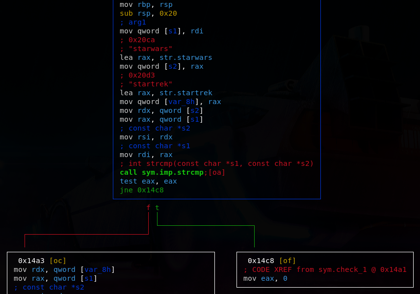

# AUCTF 2020
<div align="center"></div>

AUCTF 2020 has ended, and me and my team [**P1rates**](https://ctftime.org/team/113157) really enjoyed it as it was full of good problems, I participated as **T1m3-m4ch1n3** and here's my writeup about some of the problems that i solved.
*(if you're interested in the rest you can read the writeup of my teammate **y4mm1** [here](https://ah-sayed.github.io/posts/auctf-2020))*

## Challenges

| Title                           	      | Category      |
| --------------------------------------------|--------------:|
| [Cracker Barrel](#cracker-barrel)	      |   Reversing   |
| [Mr. Game and Watch](#mr.-game-and-watch)   |   Reversing   |
| [Sora](#sora)      		   	      |   Reversing   |
| [Don't Break Me](#don't-break-me)	      |   Reversing   |
| [Thanksgiving Dinner](#thanksgiving-dinner) |   Pwn         |

---

## Cracker Barrel
#### Reversing

### Description:
> **I found a USB drive under the checkers board at cracker barrel. My friends told me not to plug it in but surely nothing bad is on it?<br>
> I found this file, but I can't seem to unlock it's secrets. Can you help me out?<br><br>
> Also.. once you think you've got it I think you should try to connect to challenges.auctf.com at port 30000 not sure what that means, but it written on the flash drive..<br>
> [cracker_barrel](cracker%20barrel/cracker\_barrel)**

### Solution:
Firstly we start by ```strings``` command and obviously the flag isn't there so we do ```file``` command we will find it's ELF 64-bit, dynamically linked and not stripped
let's do some radare2 stuff
```
$ r2 -AA cracker_barrel
[0x00001180]> afl
```
well, here we find some interesting function names like:
```
main
sym.check
sym.check_1
sym.check_2
sym.check_3
sym.print_flag
```
then seeking to the main and entering the visual mode:
```
[0x00001180]> s main
[0x000012b5]> VV
```
we notice that main calls sym.check and then ```test eax, eax``` and the ```je``` if it's false then it calls sym.print_flag .. So whatever happens inside check() function it MUST return a non-zero value so we can get the flag!

By digging into check() function we see clearly the it takes the user input and calls check_1() function and if the return is zero it returns zero (which we don't need to happend), Otherwise it continues to call the second check which is check_2() and so on with check_3() .. so we need to make sure to return a non-zero value from these functions too

Now going deeper inside check_1():


as we see clearly it takes the user input in s1 variable, then "starwars" in s2 and compares them if they're equal then it goes to the second check which compares the user input with "startrek" if they're NOT equal it returns 1, and by that we passed the first check!


